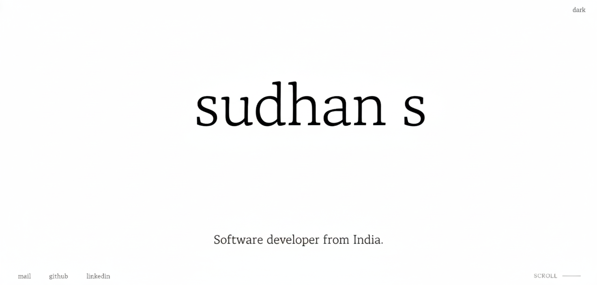

# SudhanPortfolio

Modern, performant portfolio built with Astro, featuring zero JavaScript by default and optimal performance.

<p align="center">
  
</p>

Live Site:
https://sudhancodes.github.io/

## Features

- Static Site Generation: Lightning-fast load times
- Zero JS by Default: Only hydrate what's needed
- Content Collections: Type-safe project management
- Dark Mode: Seamless theme switching
- Optimized Fonts: Preloaded custom typography
- Responsive Design: Mobile-first approach
- Accessibility: WCAG compliant
- SEO Optimized: Structured data and meta tags

## Performance

- Lighthouse Score: 100/100/100/100
- Bundle Size: <50KB total JavaScript
- First Contentful Paint: <1.2s
- Time to Interactive: <2.5s

## Tech Stack

- Framework: Astro
- Language: TypeScript
- Styling: CSS with custom properties
- Deployment: Vercel/Netlify ready

## Getting Started

```bash
npm install
npm run dev
npm run build
npm run preview
```

## Project Structure

```
src/
  components/       Reusable Astro components
  content/
    projects/       Project markdown files
  layouts/          Page layouts
  pages/            Route pages
  styles/           Global CSS
  utils/            Helper functions
public/             Static assets
astro.config.mjs    Astro configuration
```

## Key Improvements from v2.0

- 90% JavaScript Reduction: From 195KB to <50KB
- Removed GSAP: Replaced with CSS animations
- Build-time GitHub Stars: No client-side API calls
- Component Architecture: Modular and maintainable
- TypeScript: Type-safe content and props
- Optimized Fonts: Preloaded and subsetted

## Adding New Projects

Create a new `.md` file in `src/content/projects/`:

```markdown
---
title: "Project Name"
description: "Project description"
tech: ["tech1", "tech2"]
github: "https://github.com/username/repo"
live: "https://example.com"
order: 1
---
```

## Customization

- Colors: Edit `src/styles/variables.css`
- Typography: Modify font in `src/styles/fonts.css`
- Animations: Update `src/styles/animations.css`

## Commands

| Command              | Action                                           |
| :------------------- | :----------------------------------------------- |
| `npm install`        | Installs dependencies                            |
| `npm run dev`        | Starts local dev server at `localhost:4321`      |
| `npm run build`      | Build your production site to `./dist/`          |
| `npm run preview`    | Preview your build locally, before deploying     |
| `npm run astro ...`  | Run CLI commands like `astro add`, `astro check` |
| `npm run astro help` | Get help using the Astro CLI                     |

## License

MIT License

## Author

Sudhan S
Software Developer

GitHub: https://github.com/sudhancodes

LinkedIn: https://linkedin.com/in/sudhansasi22

Email: sudhansasikumar22@gmail.com
